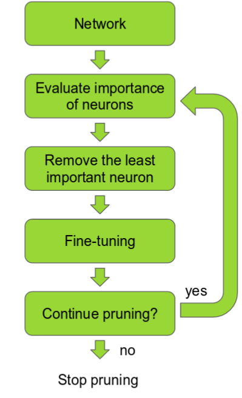

[Blog about pruning deep neural networks to make them fast and small](https://jacobgil.github.io/deeplearning/pruning-deep-learning)

Digest from this blog:

> Getting faster/smaller networks is important for running these deep learning networks on mobile devices.

> If you could rank the neurons in the network according to how much they contribute, you could then remove the low ranking neurons from the network, resulting in a smaller and faster network.

> The ranking can be done according to the L1/L2 mean of neuron weights, their mean activations, the number of times a neuron wasn’t zero on some validation set, and other creative methods . After the pruning, the accuracy will drop (hopefully not too much if the ranking clever), and the network is usually trained more to recover.

> If we prune too much at once, the network might be damaged so much it won’t be able to recover.

> So in practice this is an iterative process - often called ‘Iterative Pruning’: Prune / Train / Repeat.

### Resources

[Pytorch Simple Tutorial in 60 minutes](https://zhuanlan.zhihu.com/p/25572330)

